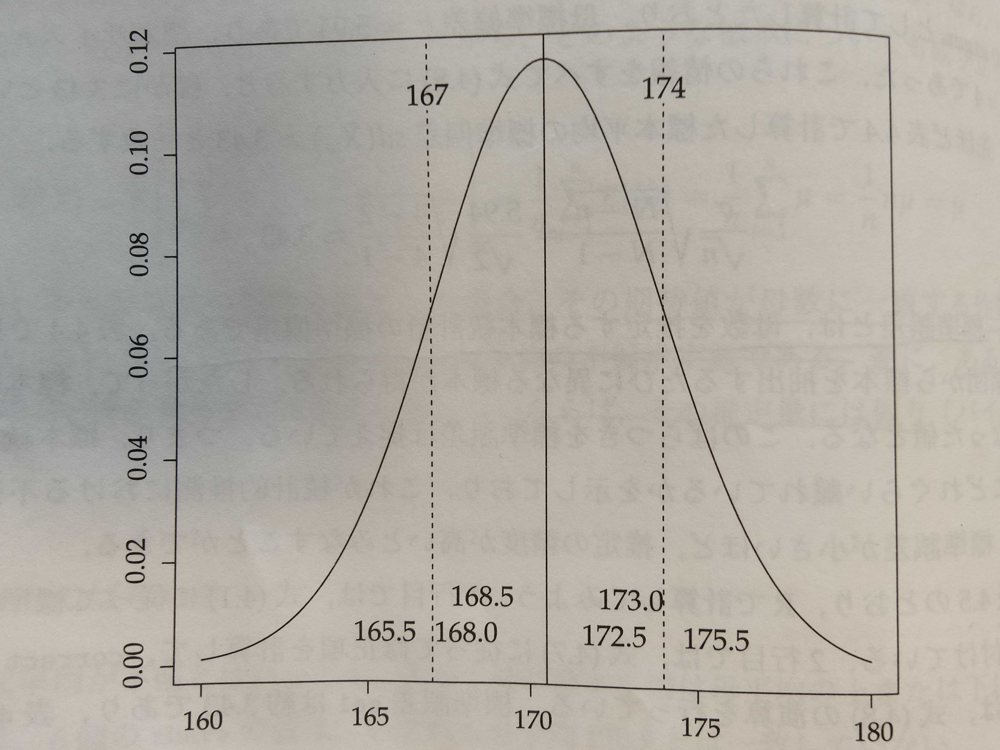

# Chapter4 推測統計の基礎：標準誤差と信頼区間

-   通常の統計解析と同様に統計的因果推論においても、手元のデータが母集団から無作為抽出された標本データである場合、母集団に対する統計的推測を行う必要がある。その為には標準誤差（standard error）を計算して、信頼区間を構築して検定を行う。

-   標準誤差とは何か、信頼区間とは何かについて具体的に検討したあと、2標本t検定のメカニズムについて解説する

# 4.1 標準誤差

**標準誤差の定義**(式4.1)

n: 標本サイズ, σ: 母標準偏差

$$
s.e(\bar{X})=\frac{σ}{\sqrt{n}}
$$

## 4.1.1 母集団データ（P45）

-   そもそも式4.1は具体的に何を意味しているのだろう？

    -   4名(N=4)の身長の母集団データ(population data)を使って、標準誤差の意味を具体的に考える

    -   標本サイズ2(n=2)の全ての標本データ(sample data)を抽出をしたときに、何が起こるのかを調べてみる

| 人名 | 身長(cm) |
|------|----------|
| A    | 165      |
| B    | 166      |
| C    | 171      |
| D    | 180      |

: 表4.1 母集団データ

-   まずは、母数(parameter)の集計を行う。

    -   母数：母平均($μ = \frac{1}{N}\sum_{i=1}^N X_i$)や母標準偏差（$σ = \sqrt{\frac{1}{N}\sum_{i=1}^N (X_i-μ)^2}$）など、母集団分布を決定する定数の事

```{r}
# 表4-2
rm(list=ls())                # ワークスペースのクリア
N1 <- 4                      # 母集団サイズ
n1 <- 2                      # 標本サイズ 
x1 <- c(165, 166, 171, 180)  # 母集団データ *c()関数は引数の値からなるベクトルを生成する
mu <- mean(x1)               # 母平均
hensa  <- x1 - mu            # 偏差 　　　　*偏差とは、個々の数値と基準値（平均値など）との差
hensa2 <- hensa^2            # 偏差の２乗
sigma2 <- sum(hensa2)/N1     # 母分散
sigma  <- sqrt(sigma2)       # 母標準偏差

mu
sigma
```

## 4.1.2 標本抽出と標本平均(P47)

表4.1の母集団データから、標本サイズn=2の全ての標本を抽出する

| 人名 | 身長(cm) |
|------|----------|
| A    | 165      |
| B    | 166      |
| C    | 171      |
| D    | 180      |

: 表4.1 母集団データ（再掲）

| 標本1 | 標本2 | 標本3 | 標本4 | 標本5 | 標本6 |
|-------|-------|-------|-------|-------|-------|
| A     | A     | A     | B     | B     | C     |
| B     | C     | D     | C     | D     | D     |

: 表4.3 標本サイズ2の全ての標本

```{r 表4.4 標本サイズ2の全ての標本の抽出}
xs    <- combn(x1, n1)       # 母集団x1から,標本サイズn1=2の標本を全て抽出
xbars <- apply(xs, 2, mean)  # 標本平均
hensab  <- xbars - mu        # 標本平均と母平均の偏差
hensa2b <- hensab^2          # 偏差の二乗
sigma2b <- sum(hensa2b)/6    # 分散（分母は標本数6である事に注意）
sigmab  <- sqrt(sigma2b)     # 標準偏差

xs                           # 標本
xbars                        # 標本平均
mean(xbars)                  # 標本平均の平均
sigmab                       # 標準偏差
```

-   xsは2×6の行列である。標本数6、標本サイズは2。

-   標本平均xbarsは6個の値から構成されており、標本抽出の度に異なる値になっている事がわかる。つまりxbarsは変数である

-   標本平均の平均mean(xbars) は170.5であり、母平均と一致している。つまり無数の標本抽出をした時、全ての標本平均の重心は、真の母平均である。このことは式(4.4)より、数学的証明が成り立つ事から、どのような標本についても成り立つ。

    $$
    E[\bar{X}]=E[\frac{1}{n}\sum_{i=1}^n X_i]=\frac{1}{n}E[\sum_{i=1}^n X_i]=\frac{1}{n}\sum_{i=1}^nE[ X_i]=\frac{1}{n}\sum_{i=1}^nμ=\frac{1}{n}nμ=μ
    $$

-   ある推定量の期待値を取った場合、

    -   その期待値が母数に一致する性質を不偏性（unbiasedness）という。つまり、標本平均は母平均の不偏推定量である。

    -   逆にその期待値が母数に一致しないならば、その推定量には偏り（バイアス: bias）があるという。

## 4.1.3 標本平均のばらつき（P48）

-   しかし、標本平均が不偏とは行っても,ある1個の標本平均は母平均の上または下にあるかもしれない。

    -   例：xbarsの値はいずれも、母平均とは一致していない(表4.4 xbars参照）

        $mu = 170.5$ $xbars = [165.5 168.0 172.5 168.5 173.0 175.5]$

-   そこで、標本平均がどれくらい母平均の上または下に位置しているかを知る必要がある。これを計算する方法が標本平均の標準偏差

    -   標本平均の標準偏差

        $sd(\bar{X_w})=\sqrt{\frac{1}{W}\sum_{i=1}^W(\bar{X_w}-μ)^2}$

        -   $w$=1,2,...Wは標本抽出の回数を表し、Wは標本数を表す

        -   標本平均の標準偏差は、標本平均と真の母平均との距離を表す

    -   理論的に標本平均の分散は$α^2/n$と表される。標本平均の標準偏差$α/n$と標準語差の式は同じになる

        式4.6

        $$
        var[\bar{X}] = var[\frac{1}{n}\sum_{i=1}^n X_i]=\frac{1}{n^2}var[\sum_{i=1}^n X_i]=\frac{1}{n^2}\sum_{i=1}^n var[X_i]=\frac{1}{n^2}\sum_{i=1}^n σ^2=\frac{1}{n^2}nσ^2=\frac{σ^2}{n}
        $$

-   式4.6は無限母集団の場合の標本平均の分散。有限母集団では、標準誤差に修正項を乗じる

    式4.7

$$
\sqrt{\frac{N-n}{N-1}}
$$

-   母標準偏差$σ=5.94$であり、標本サイズn=2、母集団サイズN=4であった。これらの式を全て式4.8に入力すると、確かに3.43という数字が計算されて、表4.4で計算した標本平均の標準偏差3.43と一致する

    式4.8

    $$
    \frac{σ}{\sqrt{n}}\sqrt{\frac{N-n}{N-1}}=\frac{5.94}{2}\sqrt{\frac{4-2}{4-1}}≈3.43
    $$

-   ルートに修正する

-   すなわち、**標準誤差とは、母数を推定する標本統計量の標準偏差**

-   表4,4で具体的に見た通り、母集団から標本を抽出するたびに異なった標本が得られる。したがって標本統計量は、標本ごとに異なった値となる。このばらつきを標準誤差は捉えている。つまり標本統計量が母数から典型的にどれくらい離れているかを示し、これが推測統計における不確実性を表す指標となる。ど推定標準誤差が小さいほの精度が高いとみなせる

```{r}
se0 <- sigma/sqrt(n1)            # 標準誤差
correct <- sqrt((N1-n1)/(N1-1))  # 修正項
se1 <- se0 * correct             # 修正項を加味した標準偏差
se1
```

## 4.1.4 中心極限定理（P50）

-   ここまで見てきた事は、中心極限定理(central limit theorem)を具体的に表現する事を試みたもの。

-   中心極限定理により、平均μと分散 $σ^2$の母集団から、標本サイズnの標本が無作為抽出されるとき、母集団の分布にかかわらず、標本平均は、平均μ、分散 $\frac{σ^2}{n}$の正規分布に従う

-   標準誤差は、標本統計量の標準偏差であるから、3標準偏差ルール**（？）**も適用できる。6個の標本のうち4個の標本統計量は、母数から1標準偏差の範囲に入っている。これは、平均±1標準偏差が、約68%という3標準偏差ルールに対応している。つまり母集団から無作為に標本を抽出したとき、約68%の信頼度で、標本統計量は167\~174の間に入っている

    -   信頼度：推定値が信頼区間にはいっている確率

        

-   式(4.9)において、標本平均$\bar{X}$を標準化した変数Xは、標準正規分布に従う。

    -   標準化：与えられたデータを、平均0で分散1のデータに変換する操作

        -   式4.9

            $$
            Z=\frac{\bar{X}-μ}{\frac{σ}{\sqrt{n}}}
            $$

## 4.1.5 t統計量（P50）

-   前項までは、母集団から全ての標本を取り出したが、ここからは標本数が1の場面を考える。前項までは、母平均μは未知だが、母標準偏差σは既知という条件で話を進めてきた。通常は母平均が未知なら、母標準偏差も未知である。そこで母標準偏差σの代わりとなる推定値が必要である。

-   手元にあるデータ母集団であれば、μとσは推定する必要はなく、データから直接計算できる。つまりμとσは既知である

-   しかし多くの場合、手元にあるデータは標本でありμとσは未知である。また、分散や標準偏差の式には、平均が含まれているため、それらの値を計算するには、平均値を知っていなければならない。母分散や母標準偏差を推定する前に、標本平均によって母平均を推定している。推定をk回行なうと、自由度(df: degrees of freedom)はk個減る。したがって標本データ分散や標準偏差を計算する際には、分母はnではなくn-1である。

    不偏分散　　：$s^2=\frac{1}{n-1}\sum_{i=1}^n(X_i-\bar{X})^2$

    標本標準偏差：$s=\sqrt{\frac{1}{n-1}\sum_{i=1}^n(X_i-\bar{X})^2}$

-   標準誤差として$\frac{σ}{\sqrt{n}}$は計算不可能である為、代わりに$\frac{s}{\sqrt{n}}$を用いる。つまり標準誤差とは母数を推定する標本統計量の標準誤差なのである。そしてσをsに置き換えたものをt統計量という。t統計量は自由度n-1のt分布に従い、t分布は小標本の厳密な標本分布である。

    t分布は自由度によって分布の形が変わる

    normalは標準正規分布。その他はt分布

    （引用元：<https://bellcurve.jp/statistics/course/8968.html>）

    

-   伝統的な教科書では、自由度 $df$のt分布の上側確率$α$のパーセント点を$t_α=(df)$と書いて、t分布表として掲載している。現代的には、R関数qtを用いて、算出する事ができる

    ```{r}
    p <- 0.025 # 片側のすそに該当する有意水準
    df <- 80-1 # 自由度 n-k kは推定すべき母数の個数。標本平均の場合自由度はn-1であるが、重回帰mモデルなどでは、推定すべき母数の個数に応じて調整する必要がある
    qt(p, df, lower.tail = FALSE) # lower.tail = FALSEで上側確率
    ```
