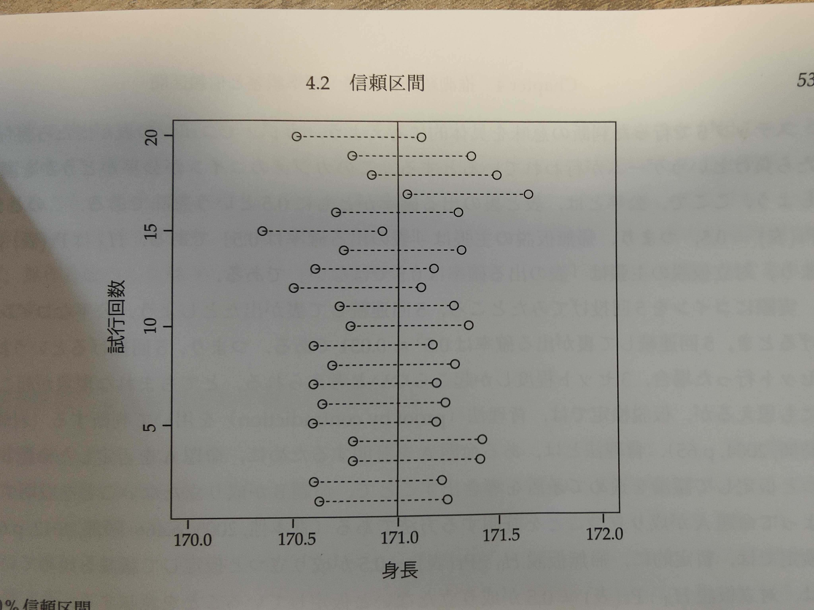

# 4.2 信頼区間（P52）

-   点推定値(point estimate)は、母数を推定する為に使われる統計量の値そのものである。

    -   例：標本平均$\bar{X}$は、母平均μの点推定値

-   しかし標本抽出誤差がある為、標本平均が母平均と完全に一致すると考える事は合理的でない。一般論として標本統計量が母数に一致する事は、ほとんどないと考えられる。

-   そこで推定値のまわりに誤差を加味した区間を構成する。区間推定値（interval estimate）とは、真の母数の値の入る確率が、ある値以上と保証される区間を求めることである。また、信頼区間（CI: confidence interval）とは、標本を何度も抽出したとき、無数にある区間のうち、ある確率で真の母数が含まれる区間のこと。1つの信頼区間の中に母数が含まれる確率は0%または100%である事に注意する。

    (引用元：<https://bellcurve.jp/statistics/course/8891.html>)

    

## 4.2.1 90%信頼区間の例（P52）

-   90%信頼区間とは？
    -   標本を何度も抽出したとき、無数にある信頼区間のうち90%の中に真の母数が含まれる区間

    -   ある1つの90%信頼区間の中に母数が含まれる確率は90%ではなく、0%または100%である。
-   信頼区間の中に母数が含まれる確率が0%または100%である意味を具体的に考える。
    -   仮に、日本人成人男性の身長の母平均を171cmとする。1000人を無作為抽出する。そしてこの標本抽出を20回行ったとする。標本サイズは1000人で、標本数は20個。

        (図4.2 90%信頼区間)

        -   実線が真の母平均171cm

        -   20本の破線は90%信頼区間

        -   20個の信頼区間の内、18個中に母平均171cmが含まれている。よって確率18/20は=90%の確率確率

        -   一番下含の信頼区間に母数が含まれている確率は100%。下から15番目の信頼区間に母数が含まれている確率は0%

            [式（4.13）標本平均の信頼区間]{.underline}

            -   $\bar{X}$は標本平均

            -   sは標本標準偏差

            -   nは標本サイズ

            -   $t_α(df)$はt分布に基づく信頼係数

                信頼係数：母平均が信頼区間の範囲に含まれる確率

            $$
            \bar{X}±t_α(df)×\frac{s}{\sqrt{n}}
            $$

            -   図4.2（P53）

        -   

## 4.2.2 信頼区間によるt検定（P52）

-   2章で見た通り、処理の割付けが無作為に行われる実験研究では、処置群と統制群の2群の比較について、2標本t検定を行う事ができた。本項では、ここまで見てきた標準誤差と信頼区間の知識を活用して2標本t検定のメカニズムを確認する。

-   まずは、1標本t検定を簡単に復習する。標準誤差と信頼区間を使って、以下の5つのステップで検定を行う。

    1.  帰無仮説(null hypothesis) $H_0$と対立仮説(alternative hypothesis)$H_A$を設定する。

        -   今回は$H_0はμ_0=255、H_Aはμ_1≠255$とし、両側検定を行うとする。

    2.  有意水準を決める。

        -   優位水準：ある事象が起こる確率が偶然とは考えにくい（有意である）と判断する基準となる確率
        -   ここでは5%とする。

    3.  データから標本平均と標本標準偏差を計算する。

        -   標本平均　　　$\bar{X}=250$

        -   標本標準偏差　$s=6$

        -   標本サイズ　　$n=50(df=49)$

    4.  信頼区間を計算する。

        ```{r}
        qt(0.025, 49, lower.tail=FALSE)
        # [1] 2.009575
        ```

        $$
        CI_{95\%}=\bar{X}±t_α(df)×\frac{s}{\sqrt{n}}=250±2.01×\frac{6}{\sqrt{50}}=(248.3,251.7)
        $$

    5.  帰無仮説を棄却できるか判断。

        -   95%信頼区間は248.3\~251.7で、帰無仮説の主張している値255は、この区間内に入っていないので、5%の優位水準で、帰無仮説を棄却できる

-   ステップ5で行った判断の意味を具体的に考える

    -   カジノでコインの表が出たらかち、裏が出たら負けというゲームが行われているとする

    -   カジノのコインが公平（表と裏の出る確率がともに0.5）かどうか調べる

        -   帰無仮説がPr(表)=0.5：表の出る確率は0.5

        -   対立仮説がPr(表)≠0.5：表の出る確率は0.5ではない

    -   実際にコインを5回投げてみたら、5回連続して裏が出たとする。

        -   公平なコインでは、5回連続して裏が出る確率は0.031。つまり５回投げるという試行を100セット行っても、3セット程度しか発生しないと考えられる。

    -   とてもまれな現象が起こったように思えるが、仮説検定では背理法を用いて判断する

        -   背理法

            ある命題Aを証明するために、命題Aを否定したい命題Bが成り立つと仮定して議論を進めて、矛盾を導き出す事で、命題Bが成り立たない事を証明することにより、命題Aが成り立つ事を証明する

            引用元：<https://juken-mikata.net/how-to/mathematics/reduction-to-absurdity.html>

            

    ```{=html}
    <!-- -->
    ```
    -   仮説検定では、暫定的に帰無仮説：Pr(表)=0.5が成り立つと仮定して議論を進めている。これは対立仮説Pr(表)≠0.5が成り立たない事を意味する。もし帰無仮説が正しければ、稀な現象が起こったと考えられた。しかし確率が0.03しかないので背理法により、そもそも最初に仮定した帰無仮説が間違っており、対立仮説が正しいと考える。

    -   そもそも帰無仮説が間違っていた場合を考える。

        -   表の出る真の確率が0.1しかないコインであったら、5回連続で裏が出る確率は0.59

        -   ５回投げるという試行を100セット行った場合、59セットも起こる

        -   そうであれば5回連続で裏が出ることにはなんの不思議もない。

        -   したがって、帰無仮説を棄却して、対立仮説を採択する。つまり、このコインは公平ではなかったと結論づける

    -   この例では、100セット中3セットを稀と判断した。一般的に仮説検定では、どの程度の確率を稀と考えるかをあらかじめ設定する。この基準の確率を有意水準αと言っていたのである。よって有意水準が0.05なら、確率0.03は十分に小さいと判断するということである。

## 4.2.3 信頼区間による対応のある場合の2標本t検定（P55）

-   対応のある場合とは

    -   同じ個体に対してペアとなる値が観測されている場合のこと。

    -   2章の表2.1の例（P17）だと、入学試験と期末試験の値が該当する。ただし前後比較は統計的因果推論としては有効ではない(P16)。有効なのは、潜在的結果変数を用いた考え方。

        | ID  | 入学試験 | 期末試験 | ・・・ |
        |-----|----------|----------|--------|
        | 1   | 74       | 76       | ...    |
        | 2   | 82       | 85       | ...    |
        | ... | ...      | ...      | ...    |

        : 2章の表2.1の例（P17）から抜粋

-   表4.6(P55)は、第2章において使用した潜在的結果変数0と潜在的結果変数1のデータである。現実には灰色セルの白抜き数字は観測されない。もし同じ個体に対して数字のペアで利用できるなら、対応のある2標本t検定を用いる。このような場面が現実に存在する？と思うかもしれない。第21章で対応のある2標本t検定を扱う

    | ID  | 潜在的結果0 | 潜在的結果1 | 差  |
    |-----|-------------|-------------|-----|
    | 1   | **68**      | 76          | 8   |
    | 2   | 75          | **84**      | 9   |
    | ... | ...         | ...         | ... |

    : 表4.6

-   ここでは、表4.6の潜在的結果0,1が実際に観測されているものとして、対応のある2標本t検定を実行する。2つの標本に対応がある場合のt検定は、本質的に1標本t検定と同じである。2つの変数の差をとったものを1つの変数と見なしして、1標本t検定を実行すれば良い

```{r データの読み込み}
rm(list=ls())
data04 <- read.csv("./causality-main/data04.csv")
attach(data04)
summary(data04)
```

```{r}
n1 <- nrow(data04) # データセットの行数を数えるこれは標本サイズを表す
diff <- y1t -y0t   # 潜在的結果1と0の差
m1 <- mean(diff)   # 差の平均値
s1 <- sd(diff)     # 差の標本標準偏差
talpha <- qt(0.025,n1-1,lower.tail = FALSE) # 95%の信頼係数
m1 + talpha*s1/sqrt(n1) # 信頼区間の上限
m1 - talpha*s1/sqrt(n1) # 信頼区間の下限
t.test(diff)            # t 検定
```

-   手作業で計算した95%信頼区間は、9.43から10.67で、t.testで出力した95%信頼区間も9.43から10.67であるから答えが一致している事が確認できる。このデータの背景は補修授業の期末試験に与える結果であった。変数diffはy1t-y0tであるから、この数字が正の値ということは、補修授業に効果があるという意味であった。95%信頼区間は0を含んでいないのだから、5%の有意水準で、母集団に置いても効果ありと判断できる

## 4.2.4 信頼区間による対応のない場合の2標本t検定（P57）

-   表4.9は2.8節（P28）において、無作為割付けの例として、使用した期末試験0と1の観測データ。

    | ID  | 期末試験0 | 期末試験1 |
    |-----|-----------|-----------|
    | 1   |           | 76        |
    | 2   | 75        |           |
    | ... | ...       | ...       |
    | 20  |           | 87        |

    : 表4.9 データ(P58)

-   ここでは、処置の割付けは無作為に行われていたため、実験研究であり、全ての交絡は調整されていると考える事ができた。同じ個体に対して処置が0または1の場合のどちらかの値しか与えられていない。このように同じ個体に対して数字のペアで利用できないのであれば、対応のない2標本t検定を用いる。2つの標本間で母分散が等しいか等しくないかで使うべき手法は異なるとされている。本書では、母分散が等しい場合の手法を「等分散の検定」と呼び、母分散が等しくない場合の手法を「Welchの検定」と呼ぶ事にする

-   しかしながら、母分散は未知であるから、標本データの情報だけからでは、母分散が等しいかどうかを判断できない。母分散の検定を行ってからt検定を行うことも考えられるが、このような2段階の方法では、多重検定の問題が発生するため、問題がより複雑になる。

    もし、母分散が等しくないのに「等分散の検定」を用いると、第1種の過誤の確率が非常に大きくなってしまうが、もし母分散が等しいのに「Welchの検定」を用いると、第2種の過誤の確率がわずかに大きくなるだけである。

    したがって本書では「Welchの検定」のみを紹介する

-   期末試験0を$Y_0^{obs}$、期末試験1を$Y_1^{obs}$で表すこととする。知りたい効果は、$\bar{Y}_1^{obs}$-$\bar{Y}_0^{obs}$、つまり、期末試験1の平均と期末試験0の平均の差である。obs=observed value

    $s_0^2$, $s_1^2$をそれぞれ$Y_0^{obs}$, $Y_1^{obs}$の不偏分散とし、$n_0, n_1$をそれぞれ$Y_0^{obs}$, $Y_1^{obs}$の標本サイズとする

    式4.15 標準誤差

    $s.e.(\bar{Y}_1^{obs}$-$\bar{Y}_0^{obs})=\sqrt{\frac{s_0^2}{n_0}+\frac{s_1^2}{n_1}}$

-   Welchの検定では自由度dfの計算が複雑である

    $$
    df=\frac{[(s_1^2/n_1)+(s_0^2/n_0)]^2}{\frac{(s_1^2/n_1)^2}{n_1-1}+\frac{(s_0^2/n_0)^2}{n_0-1}}
    $$

-   具体的な方法は、表10の通り

    ```{r message=FALSE, warning=FALSE}
    rm(list=ls())
    data04_2 <- read.csv("./causality-main/data04.csv")
    attach(data04_2)
    y0obs <- na.omit(y0)  # 欠測部分を取り除く
    y1obs <- na.omit(y1)  # 欠測部分を取り除く
    n0 <- length(y0obs)   # 観測数
    n1 <- length(y1obs)   # 観測数
    s0 <- sd(y0obs)       # 標本標準偏差
    s1 <- sd(y1obs)       # 標本標準偏差
    num <- (s1^2/n1 + s0^2/n0)^2                         # 式4.16の分子(numerator)
    denom <- ((s1^2/n1)^2)/(n1-1) + ((s0^2/n0)^2)/(n0-1) # 式4.16の分母(denominator)
    df1 <- num/denom      # 自由度の計算
    xbar <- mean(y1obs) - mean(y0obs)       # y1obsの平均とy0obsの平均との差
    se1 <- sqrt((s1^2/n1) + (s0^2/n0))      # 標準誤差の計算
    talph <- qt(0.025, df1, lower.tail = F) # 95%信頼係数
    xbar + talph * se1    # 95%信頼区間
    xbar - talph * se1　　# 95%信頼区間
    t.test(y1obs, y0obs, var.equal=FALSE)
    ```

-   手作業で計算した95%信頼区間と、t.testで出力したした95%信頼区間が3.45から18.47であるから、答えが一致している事が確認できる。95%信頼区間は0を含んでいないのだから、5%の有意水準で母集団においても効果ありと判断できる。ただし、標本サイズが非常に小さいため、不確実性が大きく、信頼区間の幅はとても大きい。
