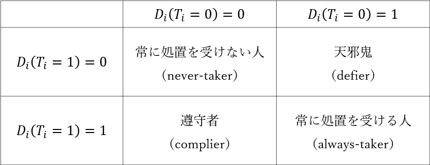
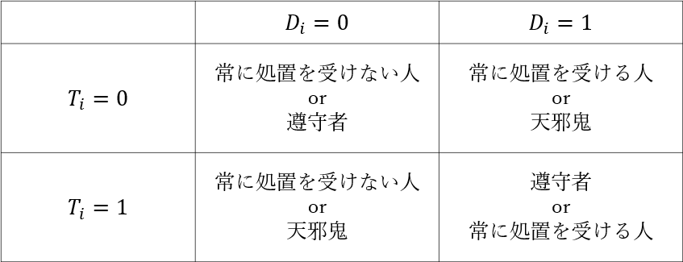
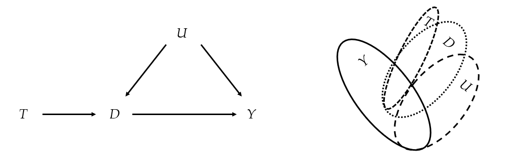

# Index

## Index {#index_1}

-   Chapter14の目的

-   14.1　非遵守（ノンコンプライアンス）

-   14.2　遵守者と非遵守者の4つの種類

-   14.3　使用するデータ

-   14.4　単調性の仮定と推定対象

-   14.5　無作為化奨励デザインと4つの推定量

-   14.6　Rによる無作為化奨励デザインの分析

-   14.7　仮定の妥当性


# Chapter14の目的 {#Ch_14_0}

## Chapter14の目的 {#Ch_14_0_1}

第13章では、操作変数法および二段階最小二乗法の基礎を押さえた

本章では、近年になって重要視される操作変数法の応用方法として、

**実験研究における無作為割付けが守られない場合の対処法**

を与える

これは、純粋な実験研究だけでなく、社会実験を行う際にも非常に有用な手法である


# 14.1　非遵守（ノンコンプライアンス） {#Ch_14_1}

## 非順守（ノンコンプライアンス）とは {#Ch_14_1_1}

具体的に、小学校低学年の児童の間で、子供向け教養テレビ番組を視聴することが、国語の成績にどれくらいの効果を与えるかについて考える

20人の児童を集めて、

- 教養テレビ番組を見る処置群（10人）
- 教養テレビ番組を見ない統制群（10人）

に無作為に割付ける

<br />
原理的には、このような実験研究を計画し実行することができそうであるが、**実際のに処置の割付けが守られるかどうか分からない**

つまり、教養テレビ番組を見ない統制群に割付けられた児童が、勝手に教養テレビ番組を見てしまうかもしれない

また、教養テレビ番組を見る処置群に割付けられた児童が、怠けて教養テレビ番組を見ないかもしれない

この実験を行っている研究者は、各家庭に常駐して見張ることができないからである

<br />
このように、割付けられた処置が守られないことを**非順守（noncompliance）**という


# 14.2　遵守者と非遵守者の4つの種類 {#Ch_14_2}

## 遵守者と非順守者 {#Ch_14_2_1}

ここで記号を導入する

テキストでは、第2章以来、個体 $i$ が処置に割付けられたかどうかを表す二値変数として、$T_{i}$ を用いてきた

$T_{i} = 0$ ならば統制群に割付けられており、$T_{i} = 1$ ならば処置群に割付けられている

<br />
新たに、$D_{i}$ を、**個体 $i$ が実際に処置を受けたかどうかを表す二値変数**と定義する

つまり、$D_{i} = 0$ ならば実際に処置を受けておらず、$D_{i} = 1$ ならば実際に処置を受けている

ここでのポイントは、**$T_{i}$ と $D_{i}$ は必ずしも同じにならないこと**である

<br />
$T_{i} = D_{i}$ ならば、処置の割付けと実際に受けた処置が一致しており、

このような個体を遵守者（complier）と呼ぶ

<br />
$T_{i} \neq D_{i}$ ならば、処置の割付けと実際に受けた処置が一致しておらず、

このような個体を非遵守者（noncomplier）と呼ぶ


## 遵守者と非遵守者の4つの種類（1/2） {#Ch_14_2_2}

$D(T_{i})$ を個体 $i$ が実際に受ける処置とする

$D(T_{i} = 1) = 0$ とは、処置の割付け $T_{i}$ が1のとき、実際に受ける処置 $D_{i}$ が0という意味

$D(T_{i} = 1) = 1$ とは、処置の割付け $T_{i}$ が1のとき、実際に受ける処置 $D_{i}$ が1という意味

$D(T_{i} = 0) = 0$ とは、処置の割付け $T_{i}$ が0のとき、実際に受ける処置 $D_{i}$ が0という意味

$D(T_{i} = 0) = 1$ とは、処置の割付け $T_{i}$ が0のとき、実際に受ける処置 $D_{i}$ が1という意味

<br />
表14.1　遵守者と非遵守者の4つの異なるタイプ

<center>



</center>


## 遵守者と非遵守者の4つの種類（2/2） {#Ch_14_2_3}

表14.1の左下の人たちは、「遵守者」（complier）である

$D_{i}(T_{i} = 1) - D_{i}(T_{i} = 0) = 1 - 0 = 1$ になる人たちで、処置の割付けによって、実際に処置を受けるように促される人たちである

<br />
表14.1の対角要素に位置する人たちは、処置の割付けによって、処置を受けるかどうかを変えない人たちである

$D_{i}(T_{i} = 1) - D_{i}(T_{i} = 0) = 0$ になる人たちで、13.2節の仮定3（除外制約）により、処置効果はゼロである

<br />
この中で、表14.1の左上の $D_{i}(T_{i} = 1) - D_{i}(T_{i} = 0) = 0 - 0 = 0$ の人たちは「常に処置を受けない人」（never-taker）といい、表14.1の右下の $D_{i}(T_{i} = 1) - D_{i}(T_{i} = 0) = 1 - 1 = 0$ の人たちは「常に処置を受ける人」（always-taker）という

<br />
表14.1の右上の人たちは「天邪鬼」（defier）である

$D_{i}(T_{i} = 1) - D_{i}(T_{i} = 0) = 0 - 1 = -1$ になる人たちで、処置の割り付けと反対の行動をとる人たちである

<br />
常に処置を受けない人、常に処置を受ける人、天邪鬼を総称して、非遵守者と呼ぶ


## 遵守者と非遵守者の例 {#Ch_14_2_4}

前節の教養テレビ番組の視聴と国語の成績の例を使って具体的に考える

遵守者とは、テレビを見るように促されて、テレビを見る児童である

常に処置を受けない人とは、テレビを見るようにいわれたかどうかにかかわらず、常にテレビを見ない児童である

常に処置を受ける人とは、テレビを見るようにいわれたかどうかにかかわらず、常にテレビを見る児童である

天邪鬼とは、テレビを見るようにいわれると見ず、テレビを見ないようにいわれると見る児童である


# 14.3　使用するデータ {#Ch_14_3}

## 使用するデータの読み込み {#Ch_14_3_1}

表14.2 データの読み込み

```{r echo=TRUE}
rm(list = ls())
data14 <- read.csv("./data/data14.csv")
attach(data14)
data14
```


## 使用するデータの解説 {#Ch_14_3_2}

このデータはGelman and Hill (2007, p.218) を参考にして作成したシミュレーションデータである

変数y3は、観測された成績である

100点満点の国語の試験の点数をイメージすればよい

変数t1は、処置の割り付けを表す $T_{i}$ である

この値は、無作為に割付けられている

変数d1は、実際に処置を受けたかどうかを表す $D_{i}$ である

ここまでが、実際に観測されるデータである

<br />

変数y0tとy1tは、潜在的結果変数の組である

変数d0tとd1tは、処置を受けるかどうかを潜在的に表す変数の組みである

変数d0tは、処置の割付けt1が0のとき、実際に処置を受けたかどうかを表す変数d1が0になるか、1になるかを潜在的に示す

変数d1tは、処置の割付けt1が1のとき、実際に処置を受けたかどうかを表す変数d1が0になるか、1になるかを潜在的に示す

これら4つの変数は、実際には観測されない


# 14.4　単調性の仮定と推定対象 {#Ch_14_4}

## 単調性の仮定 {#Ch_14_4_1}

Imbens and Angrist (1994) および、Angrist, Imbens, and Rubin (1996) は、操作変数法を利用することで、実験研究における非順守に対処できることを示した

そのためには、13.2節における仮定1（操作変数の外生性）、仮定2（操作変数の関連性）、仮定3（除外制約）に加えて、以下の仮定4を置く必要がある

<br />

**【仮定4】単調性（monotonicity）: $D_{i}(T_{i} = 1) \geq D_{i}(T_{i} = 0)$ **

<br />

遵守者は $D_{i}(T_{i} = 1) - D_{i}(T_{i} = 0) = 1$ になる人たちであり、$D_{i}(T_{i} = 1) = D_{i}(T_{i} = 0) + 1$ であるから、仮定4（単調性）を満たしている

常に処置を受けない人は、$D_{i}(T_{i} = 1) - D_{i}(T_{i} = 0) = 0$ になる人たちであり、$D_{i}(T_{i} = 1) = D_{i}(T_{i} = 0)$ であるから、仮定4（単調性）を満たしている

常に処置を受ける人は、$D_{i}(T_{i} = 1) - D_{i}(T_{i} = 0) = 0$ になる人たちであり、$D_{i}(T_{i} = 1) = D_{i}(T_{i} = 0)$ であるから、仮定4（単調性）を満たしている

天邪鬼は、$D_{i}(T_{i} = 1) - D_{i}(T_{i} = 0) = -1$ になる人たちであり、$D_{i}(T_{i} = 1) = D_{i}(T_{i} = 0) - 1$ であるから、仮定4（単調性）を満たしていない

すなわち、**仮定4（単調性）は、天邪鬼がいないという仮定である**


## 単調性の仮定と推定対象（1/4） {#Ch_14_4_2}

$T_{i}$ は、個体 $i$ が処置に割付けられたかどうかを表す二値変数であった

また、$D_{i}$ は、個体 $i$ が実際に処置を受けたかどうかを表す二値変数であった

表14.3は、この2つの関係から、前述の4つのタイプを再分類したものである

なお、$T_{i} = D_{i}$ は遵守者を、$T_{i} \neq D_{i}$ は非順守者を意味していた

<br />
表14.3

<center>



</center>


## 単調性の仮定と推定対象（2/4） {#Ch_14_4_3}

仮定4（単調性）が満たされているならば、表14.3から天邪鬼を消去できるため、議論が容易になる

現実には、天邪鬼と言われる人たちは存在するかもしれないが、非常にわずかと考えられるため、比較的に妥当な仮定であろう

特に、処置を奨励することで、明らかにやる気が増大すると考えられるならば、仮定4（単調性）の妥当性も高いであろう

<br />
残りの3種類の中で、常に処置を受ける人と常に処置を受けない人は、処置があってもなくても、処置を受けるか受けないかを変えない

よって、除外制約により、処置効果はゼロである

<br />
したがって、残った遵守者について、平均処置効果（ATE）を推定する

遵守者（complier）を $C$ で表すと、遵守者に限定した平均処置効果は、式(14.1)のとおりである

これを遵守者の平均因果効果（CACE: complier average causal effect）、または局所的な平均処置効果（LATE: local average treatment effect）という

$$
CACE = E[Y_{i}(1) - Y_{i}(0)] \tag{14.1}
$$

## 単調性の仮定と推定対象（3/4） {#Ch_14_4_4}

表14.4のとおり、表14.2におけるCACEの真値を計算する

変数d0tとd1tは、処置を受けるかどうかを潜在的に表す変数の組である

したがって、1行目は遵守者全員が処置を受けた場合の潜在的結果の平均値である

2行目は遵守者全員が処置を受けなかった場合の潜在的結果の平均値である

その差が推定対象となるCACEで、ここでは7.875である

<br />

表14.4　真のCACEの計算

```{r echo=TRUE}
m1 <- mean(y1t[d0t == 0 & d1t == 1])
m0 <- mean(y0t[d0t == 0 & d1t == 1])
m1 - m0
```


## 単調性の仮定と推定対象（4/4） {#Ch_14_4_5}

表14.3からわかるとおり、「遵守者」の一部と「常に処置を受ける人」の一部、あるいは、「遵守者」の一部と「常に処置を受けない人」の一部は、それぞれ同じカテゴリにいる

したがって、一般的に、どの個体が遵守者であるのかを識別することはできない

しかし、遵守者の比率は推定できることから、その集団における平均処置効果として意味がある

<br />
たとえば、通常の実験研究において被験者が男性だけの場合、男性の平均因果効果を推定したことになり、この推定結果は女性には当てはまらないかもしれない

しかし、この研究結果は、男性において平均的にどのくらい因果効果があるかを示すことはできているわけであるから、その範囲内において有意義である

<br />
このように、CACEは、局所的な因果効果を示していると理解できるため、その範囲内において意味がある


# 14.5　無作為化奨励デザインと4つの推定量 {#Ch_14_5}

## 無作為化奨励デザインと4つの推定量 {#Ch_14_5_1}

テレビ視聴と国語の成績のような実験研究では、児童がテレビを実際に見るかどうかは無作為化できなかった

しかし、テレビを見るように、あるいは、テレビを見ないように奨励でき、この奨励は無作為化できる

これを**無作為化奨励デザイン（randomized encouragement design）という**

つまり、児童に対して、テレビを見るか見ないかの奨励を無作為に行い、その後、実際にその奨励に従うかどうかは、児童に任せるというデザインである

このとき、以下の4種類の推定量が与えられる


- AT（As Treated）：実際に受けた処置に基づく推定量
- PP（Per Protocol）：処置の割付けを遵守した被験者のみに基づく推定量
- ITT（Intention To Treat）：処置意図に基づく推定量
- IV（Instrumental Variable）：操作変数推定量


以下、これら4つの推定量の定義を与える

また、表14.2のdata14から、観測データであるy3, t1, d1のみを使って、実際にこれらの4つの推定量をRで計算する

表14.4で計算したとおり、CACEの真値は7.875であるから、この数字に最も近い推定値がよい結果と考えられる


## AT推定量 {#Ch_14_5_2}

AT推定量は、式(14.2)のとおり、処置の割付け $T_{i}$ ではなく、実際に受けた処置 $D_{i}$ に基づく推定量である

この推定量は、未観測の交絡のため偏りが発生するおそれがある

交絡の影響は過大になることもあれば、過小になることもあるため、交絡の調整を行わないならば、ATは推奨されない

$$
AT = E[Y_{i} | D_{i} = 1] - E[Y_{i} | D_{i} = 0] \tag{14.2}
$$

表14.5のとおり、ATを計算すると、2.917である

CACEの真値は7.875であるから、偏りは-4.958である

実際に受けた処置が0か1かを問うのであるから、条件となるのはd1である

<br />
表14.5　ATの計算

```{r echo=TRUE}
m1at <- mean(y3[d1 == 1])
m0at <- mean(y3[d1 == 0])
m1at - m0at
```

## PP推定量 {#Ch_14_5_3}

PP推定量は、式(14.3)のとおり、処置の割付け $T_{i}$ と実際に受けた処置 $D_{i}$ が一致している集団に基づく推定量である

この推定量も、未観測の交絡のため偏りが発生するおそれがある

ATの場合と同様に、交絡の影響は過大になることもあれば、過小になることもあるため、交絡の調整を行わないならば、PPも推奨されない

$$
PP = E[Y_{i} | T_{i} = D_{i} = 1] - E[Y_{i} | T_{i} = D_{i} = 0] \tag{14.3}
$$

表14.6のとおり、PPを計算すると、4.625である

CACEの真値は7.875であるから、偏りは-3.25である

割付けと実際に受けた処置が一致するのであるから、条件は「t1==1 かつ d1==1」の群と、「t1==0 かつ d1==0」の群との平均の差である

<br />
表14.6　PPの計算

```{r echo=TRUE}
m1pp <- mean(y3[t1 == 1 & d1 == 1])
m0pp <- mean(y3[t1 == 0 & d1 == 0])
m1pp - m0pp
```

## ITT推定量（1/2） {#Ch_14_5_4}

ITT推定量は、式(14.4)のとおり、実際に受けた処置 $D_{i}$ にかかわらず、処置の割付け $T_{i}$ に基づく推定量である

この推定量も偏りがあり得るが、効果がある場合には、効果の過小推定になることが知られている

したがって、無意味な推定量ではなく、CACEの真値を過小推定しているという条件付きで推奨される

$$
ITT = E[Y_{i} | T_{i} = 1] - E[Y_{i} | T_{i} = 0] \tag{14.4}
$$

表14.7のとおり、ITTを計算すると、3.6である

CACEの真値は7.875であるから、偏りは-4.275であり、やはりCACEの真値を過小推定している

処置の割り付けが0か1かを問うのであるから、条件となるのはt1である

<br />
表14.7　ITTの計算
```{r echo=TRUE}
m1itt <- mean(y3[t1 == 1])
m0itt <- mean(y3[t1 == 0])
m1itt - m0itt
```

## ITT推定量（2/2） {#Ch_14_5_5}

疫学では、医師の処方した薬剤を指示通り飲まない人がいることから、交絡がないことに重きを置いて、過小評価であってもITTを優先するという指摘がある

実際に、欠測データを使った臨床研究の文脈において、O'Kelly and Ratitch（2014, p.8）は、被験者の一部ではなく、ITTのように被験者全体に適用できる手法がよいと述べている

また、ローゼンバウムも、「ノンコンプライアンスが生じる場合には通常、intention-to-treat(ITT)と呼ばれる解析が行われる」と述べている

しかし、このように述べた次の段階において、ローゼンバウムは、ITT解析はIV解析によって補われ得るから、この2つの解析はどちらも有用であると指摘している

## IV推定量 {#Ch_14_5_6}

IV推定量は、第13章で解説した操作変数推定量であるが、記号が少し異なる

処置の割り付け $T_{i}$ が操作変数であり、実際の処置の有無 $D_{i}$ が共変量である

グラフで表すと、図14.1のとおりである

<center>



</center>

図14.1

## IV推定量 {#Ch_14_5_7}


第13章と同じように考えると、操作変数推定量は、式(14.5)のとおりであった

$$
IV = \frac{\rm{cov}[T_{i}, Y_{i}]}{\rm{cov}[T_{i}, D_{i}]} \tag{14.5}
$$

しかし、$T_{i}$ と $D_{i}$ は二値であるから、式(14.6)のとおり、少し変形する必要がある

$$
\begin{align}
IV &= \frac{E[Y_{i}|T_{i}=1] - E[Y_{i}|T_{i}=0]}{E[D_{i}|T_{i}=1] - E[D_{i}|T_{i}=0]} \\
   &= \frac{E[Y_{i}|T_{i}=1] - E[Y_{i}|T_{i}=0]}{Pr[D_{i} = 1|T_{i}=1] - Pr[D_{i} = 1|T_{i}=0]}  \tag{14.6}
\end{align}
$$
<br />
式(14.6)の分子は $T_{i} = 1$ のときの $Y_{i}$ の期待値と $T_{i} = 0$ の時の $Y_{i}$ の期待値との差である

これは、式(14.4)のITT推定値と同じである

また、$T_{i}$ と $D_{i}$ が両方とも二値であるから、分母は $T_{i} = 1$ のときに $D_{i} = 1$ となる確率と、$T_{i} = 0$ のときに $D_{i} = 1$ となる確率の差である

すなわち、操作変数推定量IVは、処置の割付け $T_{i}$ の奨励で影響を受けた個体の比率によってITT推定量を割ることで、ITT推定量の過小評価を是正している

<br />
実証研究を報告する際には、ITT推定量とIV推定量の両方を報告することが推奨されている


# 14.6　Rによる無作為化奨励デザインの分析 {#Ch_14_6}

## Rによる無作為化奨励デザインの分析（1/5） {#Ch_14_6_1}

操作変数法自体の考え方は、第13章と同じである

表14.8　RパッケージAERによる二段階最小二乗法

```{r echo=TRUE, message=FALSE}
library(AER)
modelIV <- ivreg(y3 ~ d1|t1)
summary(modelIV)
confint(modelIV)
```

## Rによる無作為化奨励デザインの分析（2/5） {#Ch_14_6_2}

操作変数推定量は、9.000である

CACEの真値は7.875であるから、偏りは1.125であり、小標本なので十分に偏りが除き切れてはいないが、4つの推定量の中で最も偏りが小さいことは確認できる

また、小標本なので95%信頼区間の幅はとても大きい

操作変数推定量は、一致推定量であるから、大標本であれば、偏りも小さく、優位な結果が期待できる

<br />

改めて、表14.9のとおり、二段階最小二乗法を手作業で実行することで、操作変数推定量の意味を確認する

具体的には、操作変数推定量とITT推定量の関係を確認する

summary関数で結果を表示する

## Rによる無作為化奨励デザインの分析（3/5） {#Ch_14_6_3}

表14.9　手作業による二段階最小二乗法

```{r echo=TRUE}
model1 <- lm(d1 ~ t1)
model2 <- lm(y3 ~ t1)
summary(model1)
```

## Rによる無作為化奨励デザインの分析（4/5） {#Ch_14_6_4}

表14.9　手作業による二段階最小二乗法（つづき）

```{r echo=TRUE}
summary(model2)
```


## Rによる無作為化奨励デザインの分析（5/5） {#Ch_14_6_5}

まず、表14.2のt1とd1を見てほしい

t1が1であり、d1が1となっている8つの個体（行番号=11, 12, 13, 14, 17, 18, 19, 20）が、処置の割り付け $T_{i}$ の奨励によって影響を受ける個体である

つまり、20個体中8個体であるから、0.4である

一段階目の推定値0.4は、処置の割付け $T_{i}$ の奨励によって影響を受けた個体の比率を表している

二段階目の推定値3.6は、表14.7で計算したITTの推定値と同じである

3.6を0.4で割ると、9である

この値は操作変数法に依る推定値と一致している

すなわち、前節で述べたとおり、操作変数推定量IVは、処置の割付け $T_{i}$ の奨励で影響を受けた個体の比率によってITT推定量を割ることで、ITT推定量の過小推定を是正している

<br />

この解析の結論は、以下のとおりである

**子供向け教養テレビ番組を視聴することは、遵守者の国語の成績に対して、平均的に9点の効果を与えると解釈できる**

ただし、小標本なので、統計的には優位な結果ではない


# 14.7　仮定の妥当性 {#Ch_14_7}

## 仮定の妥当性 {#Ch_14_7_1}

操作変数法によってCACEを適切に推定するためには、以下の仮定1から仮定4を満たす必要があった

この点について確認する

【仮定1】操作変数の外生性

【仮定2】操作変数の関連性

【仮定3】除外制約

【仮定4】単調性


## 仮定1（操作変数の外生性）の妥当性 {#Ch_14_7_2}

仮定1（操作変数の外生性）は、操作変数がすべての交絡因子と独立という意味である

無作為化奨励デザインでは、処置の奨励 $T_{i}$ は無作為化されている

そして、この $T_{i}$ が操作変数であり、無作為化されているわけであるから、すべての交絡因子と独立と考えてよいはずである

よって、仮定1（操作変数の外生性）は満たされている可能性が極めて高い

## 仮定2（操作変数の関連性）の妥当性 {#Ch_14_7_3}

仮定2（操作変数の関連性）は、操作変数 $T_{i}$ が実際の処置の割付け $D_{i}$ と関連があるという意味である

処置の奨励 $T_{i}$ が行われてから、実際に処置を受けるかどうか $D_{i}$ を決めるのだから、理論的にこの2つは関連していると考えるのが普通だろう

また、第13章の場合と同様に、観測データからも検証できる

今回の場合、$T_{i}$ と $D_{i}$ はどちらも二値変数であるから、クロス集計表から連関を調べられる

対角要素の方が、非対角要素よりも多いので、関連はありそうである

```{r echo=TRUE}
table(d1, t1)
```


## 仮定3（除外制約）の妥当性 {#Ch_14_7_4}

仮定3（除外制約）は、処置の奨励 $T_{i}$ によって行動を変えない個体にとっては、処置の奨励 $T_{i}$ による結果変数への影響はないという意味である

今回の例では、子供向け教養テレビ番組を視聴するように奨励されても、その番組を視聴しないのであるから、処置の奨励 $T_{i}$ は結果変数に影響しないはずである

<br />
ただし、以下のような場合、仮定3（除外制約）が満たされない可能性がある

処置の奨励とともに、それを実行するための経費が支払われているとする

このとき、処置の奨励があるにもかかわらず処置を受けないとき、その経費を別の用途で使ってしまうことがあり得る

そして、その別の用途を通じて、結果変数が影響を受けることもあり得る

たとえば、今回の例では、教養テレビ番組の視聴を促すために、テレビの購入資金が与えられたとする

しかし、テレビは購入せずに、学習参考書を購入するかもしれない

この場合、処置の奨励によって、行動を変えていないが、学習参考書を購入したことで成績が上がると考えられるため、処置の奨励によって結果変数が影響を受ける


## 仮定4（単調性）の妥当性 {#Ch_14_7_5}

仮定4（単調性）は、天邪鬼はいないという意味である

すでに述べたとおり、確かに天邪鬼存在するかもしれないが、大多数の人はそのような行動はとらないだろうから、比較的に妥当な仮定であろう


## 仮定の妥当性まとめ {#Ch_14_7_5}

したがって、仮定1（操作変数の外生性）、仮定2（操作変数の関連性）はほぼ間違いなく満たされており、仮定3（除外制約）と仮定4（単調性）は満たされていない可能性はあるものの、合理的に妥当な仮定と考えられる

ゆえに、テキストで紹介された非順守の対処法としての操作変数法の利用方法は、第12章での観察研究における除外変数への対処法とは対照的に、誰も文句を言わないとも評されている

